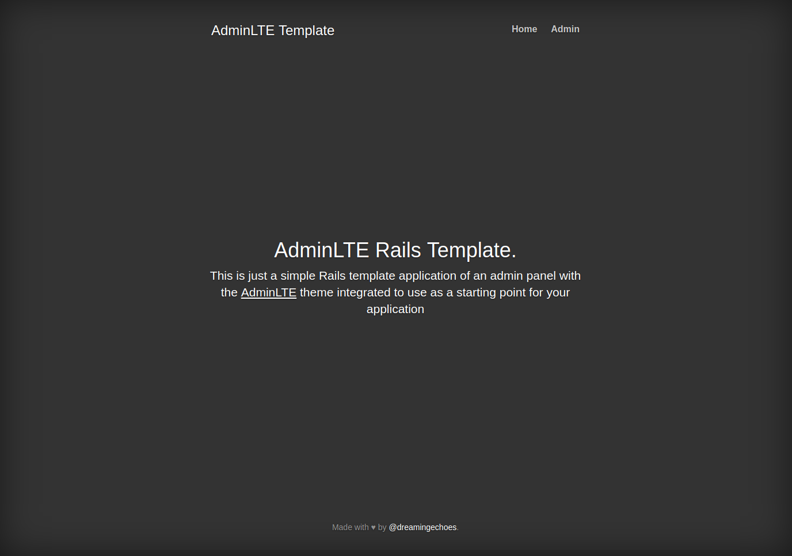
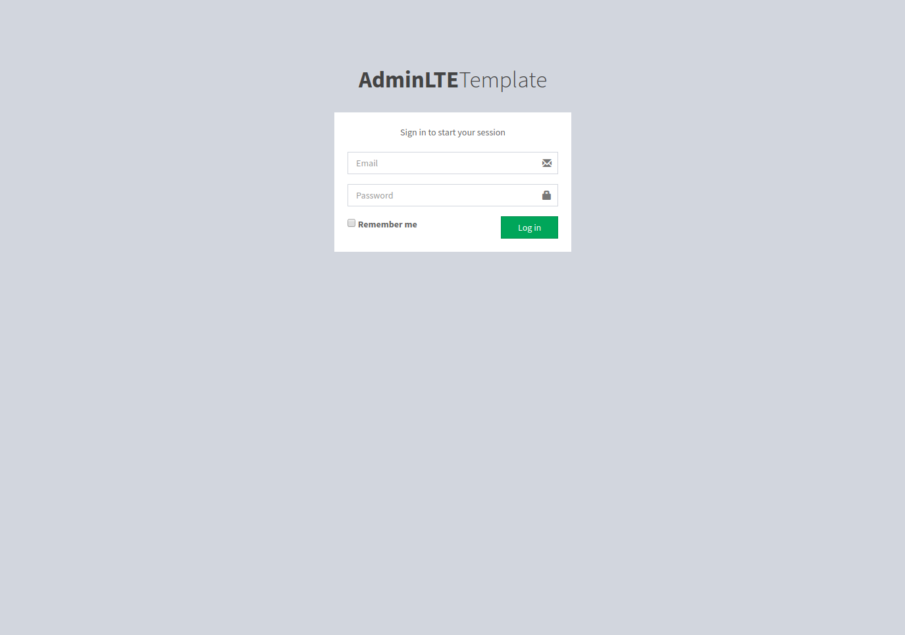
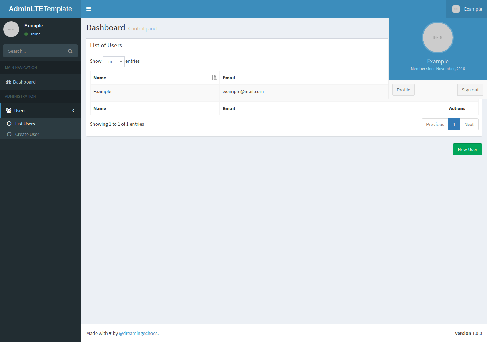

Adminlte Rails Template
=======================

This is just a simple Rails template application of an admin panel with the [AdminLTE](https://almsaeedstudio.com/) (v.2.3.7) theme integrated to use as a starting point for your application.

Main features included by default:

- [Devise](https://github.com/plataformatec/devise) with default modules.
- [AdminLTE](https://almsaeedstudio.com/) (v.2.3.7) theme included for the admin panel.
- [SendGrid](https://github.com/stephenb/sendgrid) gem for mailing.
- Continuous testing with [Guard](https://github.com/guard/guard).
- Puma server.
- PostgreSQL database.
- ERB template engine.

There is an user example ready to use to login with email `user@example.com` and password `123456789`.


Home page.


Login page.


Dashboard page.

Original author
---------------

Iván González, *a.k.a* [dreamingechoes](https://github.com/dreamingechoes)

Regular development environment setup
-------------------------------------

To start using this template, you only have to do the typical ***Rails*** things:

* Install ***Ruby*** version 2.4.0 (using [RVM](https://github.com/rvm/rvm) or [RBenv](https://github.com/sstephenson/rbenv) or [asdf](https://github.com/asdf-vm/asdf) or whatever).

* Clone the repo and do the ***bundle install*** thing:

```sh
user@computer:~$ git clone git@github.com:dreamingechoes/adminlte-rails-template.git YOUR_APP_NAME_HERE
user@computer:~$ cd YOUR_APP_NAME_HERE
user@computer:/YOUR_APP_NAME_HERE$ bundle install
```

Duplicate all the `.example` files on the project (`config/database.yml.example`, `config/secrets.yml.example`, `.env.example`...) removing the `.example` extension, and complete them with the proper information. Then execute this to create the database:

```sh
user@computer:/YOUR_APP_NAME_HERE$ rake db:setup
user@computer:/YOUR_APP_NAME_HERE$ rake db:seed
```

And you're ready to go. Test if all it's ok by starting a server and check it with `rails s`. To enable any AdminLTE plugin, just simply open the `assets/javascripts/application_back.js` and `assets/stylesheets/application_back.scss` manifest files to require the needed asset files.

You can see the complete documentation of the AdminLTE theme [here](https://almsaeedstudio.com/themes/AdminLTE/documentation/index.html) in order to add all the widgets that you need for your application.

Setup development environment with Docker
-----------------------------------------

This project is Docker friendly, so if you want to use Docker with this template, just execute:

* Setup the web container with `docker-compose build web`
* Create database with `docker-compose run web rake db:create`
* Execute migrations with `docker-compose run web rake db:migrate`
* Start the application with `docker-compose up`

If you want to create an example user with the proper service, just execute:

```sh
user@computer:/YOUR_APP_NAME_HERE$ docker-compose exec web rails c
```

and on the Rails console execute:

```sh
[1] pry(main)> CreateAdminService.new.call
```

----------------------------

This project was developed by [dreamingechoes](https://github.com/dreamingechoes).
It adheres to its [code of conduct](https://github.com/dreamingechoes/base/blob/master/files/CODE_OF_CONDUCT.md) and
[contributing guidelines](https://github.com/dreamingechoes/base/blob/master/files/CONTRIBUTING.md), and uses an equivalent [license](https://github.com/dreamingechoes/base/blob/master/files/LICENSE).
